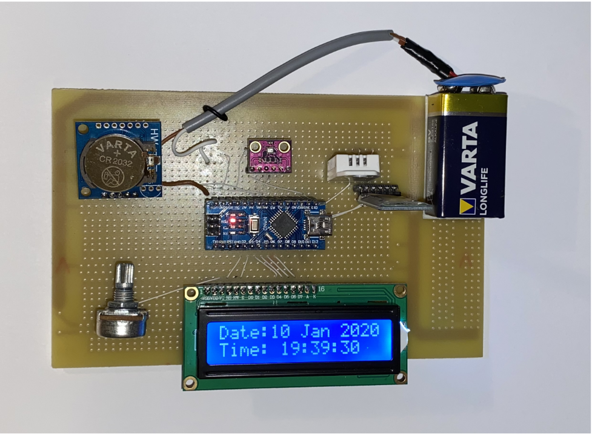
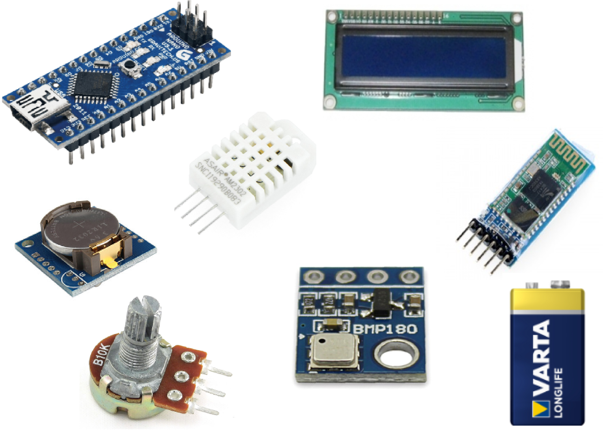

# Kurs IO LAB , rok akademicki 2019/20 .

|  Temat projektu : | Stacja pogodowa  |
| :------------: | :------------: |
|  Autorzy :  |  Przemys³aw Widz , Oskar Wiêckowicz   |
| Prowadz¹cy :  | Mgr inz. Wojciech Tarnawski  |
|  Data oddania :  | 14.01.2020r.  |
|  Termin zajêæ :   |  PIATEK/TP 14:30 - 17:30 | 

 [fig:my~l~abel]

Za³o¿enia projektowe
====================

Celem projektu by³o stworzenie prostej stacji pogodowej, powiadamiaj¹cej
u¿ytkownika o nastêpuj¹cych informacjach :

1.  bie¿¹cy czas i data

2.  temperatura powietrza pochodz¹ca z dwóch osobnych czujników

3.  ciœnienie atmosferyczne

4.  wilgotnoϾ powietrza

Do stacji pomiarowej dodano równie¿ modu³ Bluetooth umo¿liwiaj¹cy zdalne
wysy³anie bie¿¹cych danych z czujników na komputer lub smartfon.

U¿yte elementy
==============

[fig:my~l~abel]

**Do przygotowania stacji pogodowej u¿yto nastêpuj¹cych elementów :**

-   **Klon Arduino Uno** (do wstêpnego projektu na p³ytce stykowej)

    Arduino Uno to popularna p³ytka z mikrokontrolerem ATmega328 z
    rodziny AVR wyposa¿ony w 14 cyfrowych wejœæ/wyjœæ z czego 6 mo¿na
    wykorzystaæ jako wyjœcia PWM oraz 6 analogowych wejœæ.

-   **Klon Arduino Nano** (do projektu koñcowego)

    Arduino Nano to popularna wersja Uno w mniejszym rozmiarze: 45 x 18
    mm. P³ytka zawiera mikrokontroler ATmega328 wyposa¿ony w 22 cyfrowe
    wejœcia/wyjœcia z czego 6 mo¿na wykorzystaæ jako wyjœcia PWM oraz 8
    jako wejœcia analogowe.

-   **Wyœwietlacz LCD 2x20**

    Popularny wyœwietlacz 2 x 20 znaków podœwietlany w kolorze
    niebieskim.

-   **Czujnik temperatury i wilgoci DHT22**

    Czujnik temperatury i wilgotnoœci powietrza z interfejsem cyfrowym,
    jednoprzewodowym. Zakres pomiarowy: temperatura -40 do 80 °C,
    wilgotnoϾ 0-100 %RH.

-   **Modu³ bluetooth HC-05**

    Modu³ Blootooth v2.0 + EDR klasa 2. Pracuje z napiêciem 3,3 V,
    komunikuje siê poprzez interfejs szeregowy UART (piny RX, TX),
    wspiera komendy AT. Maksymalna moc nadajnika wynosi + 4 dBm, czu³oœæ
    odbiornika to - 85 dBm. Modu³ Bluetooth pozwala na po³¹czenie
    dowolnego urz¹dzenia z telefonem, smartfonem, tabletem lub innym
    urz¹dzeniem bezprzewodowo.

-   **Czujnik ciœnienia atmosferycznego i temperatury BMP280**

    Modu³ z cyfrowym barometrem firmy Bosch BMP180. Zakres pomiarowy
    wynosi od 200 do 1100 hPa z dokonanoœci¹ 0,02 hPa. Zasilany jest
    napiêciem z zakresu 1,8 - 3,6 V.

-   **Zegar czasu rzeczywsitego RTC DS1307**

    Modu³ z zegarem czasu rzeczywistego i rezerwowym zasilaniem
    bateryjnym, które ma na zadanie podtrzymanie pracy zegara po zaniku
    g³ównego zasilania uk³adu. Pozwala na odczyt czasu w postaci
    godziny, minuty i sekundy oraz daty: miesi¹c, dzieñ, rok.
    Interfejsem komunikacyjnym jest magistrala I2C.

-   **Potencjometr 10k**

    Rezystor nastawny, który dzia³a na zasadzie klasycznego dzielnika
    napiêcia. Typowym zastosowaniem potencjometrów jest regulacja pr¹du
    lub napiêcia w urz¹dzeniach elektrycznych. W tym przypadku zosta³
    u¿yty do regulacji kontrastu w wyœwietlaczu LCD.

-   **Bateria 9V**

    Bateria u¿yta do samodzielnego zasilania stacji pogodowej.

Dzia³anie stacji pogodowej
==========================

Stacja pogodowa dokonuje pomiarów wilgotnoœci, temperatury, ciœnienia
atmosferycznego oraz czasu. Nastêpnie wyniki pomiarów pokazywane s¹ na
wyœwietlaczu LCD oraz przesy³ane przez bluetooth na telefon lub komputer
i wyœwietlane na nich za pomoc¹ aplikacji Bluetooth Terminal.

Wyœwietlanie danych na wyœwietlaczu odbywa siê co dwie sekundy, w
kolejnoœci zgodnej z pêtl¹ g³ówn¹ programu :

-   temperatury (z obu czujników)

-   ciœnienie i wilgotnoœæ

-   data i czas

Zatem czas trwania pêtli to 6 sekund (3 x 2 sekundy), zakoñczone
wys³aniem danych na komputer lub smartfon.

[fig:my~l~abel]

 [fig:my~l~abel]

Przebieg realizacji projektu
============================

Prototyp stacji pogodowej by³ realizowany na p³ytce stykowej przy pomocy
Arduino Uno. Budowe stacji pogodowej zaczêto od pod³aczenia czujników do
Arduino oraz stworzenia programu obs³uguj¹cego je. Nastepnie dodany
zosta³ wyœwietlacz LCD, na którym zosta³y wyœwietlone dane pomiarowe.
Kolejnym etapem by³a realizacja komunikacji bezprzewodowej przy pomocy
modu³u bluetooth oraz zasilanie z baterii. Nastêpnie, gdy prototypowa
stacja pogodowa dzia³a³a poprawnie, zamieniono Ardunino Uno na Arduino
Nano w celu zaoszczêdzenia miejsca na uniwersalnej p³ytce PCB, do której
przylutowane zosta³y wszystkie elementy.

Podczas realizacji projektu napotkano kilka problemów. Jednym z nich by³
niedzia³aj¹cy wyœwietlacz LCD, na którym mia³y byæ wyœwietlane dane
pomiarowe. Okaza³o siê, ¿e z³¹cza mêskie dziêki, którym mozna umieœciæ
wyœwietlacz na p³ytce stykowej nie by³y do niego przylutowane przez co
jakiœ element nie styka³. W pierwotnym projekcie bezprzewodowa
komunikacja stacji pogodowej mia³a byæ realizawana za pomoc¹ wifi.
Zakupiono wiêc modu³ ESP8266, jednak napotkano problemy, których nie
uda³o siê rozwi¹zaæ. W efekcie bezprzewodow¹ komunikacjê zrealizowano
przy pomocy modu³u bluetooth HC-05, który pozwala przesy³aæ dane na
telefon. Dane odebrane ze stacji pogodowej wyœwietlane s¹ w aplikacji
Bluetooth Terminal.

Arduino zapewnia gotowe biblioteki przez co programowanie
mikrokontrolera jest programowaniem wysokopoziomowym, a co za tym idzie
du¿o przyjemniejszym i prostszym. Ka¿dy modu³ u¿yty w projekcie mia³
swoje dedykowane biblioteki, dziêki czemu w kodzie Ÿród³owym pos³ugiwano
siê obiektami gotowych klas.

Schemat po³¹czeñ
================

 [fig:my~l~abel]

Kosztorys projektu
==================

1.  Arduino Nano klon - **21.00 z³**

2.  P³ytka uniwersalna “U-11” - **element z laboratorium**

3.  Czujnik DHT22 - **22.00 z³**

4.  Wyœwietlacz LCD - **17.50 z³**

5.  Czujnik BMP280 - **12.00 z³**

6.  Rezystor 10k - **0.05 z³**

7.  Zegar czasu rzeczywistego RTC DS1307 - **11.60 z³**

8.  Bateria 9V - **5.00 z³**

9.  Modu³ bluetooth HC-05 - **22.30 z³**

10. Potencjometr - **3.00 z³**

**Ca³kowity koszt stacji pogodowej - 114.45 z³**\

Wnioski
=======

-   Budowa stacji pogodowej jest czasoch³onnym zajêciem. Ma³y b³¹d mo¿e
    kosztowaæ nawet kilka godzin pracy. Jednak podczas realizacji tego
    projektu mo¿na siê nauczyæ wiele praktycznych rzeczy z dziedziny
    elektroniki i programowania.

-   Najtrudniejszym etapem okaza³a siê realizacja odpowiednich po³¹czeñ
    elektrycznych pomiedzy poszczególnymi elementami stacji pogodowej.
    Natomiast najprostszym etapem by³o programowanie.

-   Porównuj¹c koszt zbudowania stacji pogodowej z cen¹ takiego
    urz¹dzenia zakupionego w sklepie elektronicznym mo¿na dojœæ do
    wniosku, ¿e czasami warto jest zrealizowaæ jakiœ projekt samemu i
    zaoszczêdziæ pieni¹dze. Koszt stacji wyniós³ 114,45z³, gdzie w
    sklepie elektronicznym trzeba zap³aciæ œrednio 150z³. Zamawiaj¹c
    elementy do budowy stacji z Chin, a nie od Polskich poœredników,
    mo¿na by by³o zaoszczêdziæ jeszcze wiêcej.

